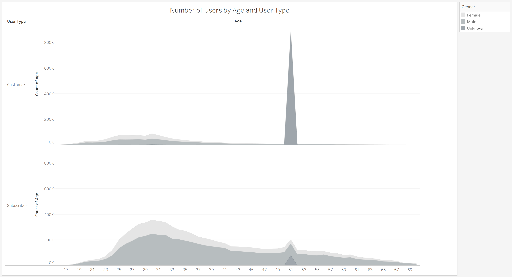

# Tableau-Citi-Bike-Analysis

## Data: 

The data used for this analysis consists of the months April, May, and June for the years 2019 and 2020. Since Tableau Public only allows for 15 million lines worth of data on their free version, this is the limited data set we can use to perform this analysis. 

 * The data can be found at the following link: https://www.citibikenyc.com/system-data

## Analysis: 

We are working with the years 2019 and 2020 to find any anomalies that the COVID-19 pandemic may have on bike usage in the city of New York where it was devastating early on in the year. The questions we are addressing are the following:
  *	What was the effect on total trip duration during this three-month period?
  * What has happened to the number of subscribers during this three-month period?
  
To begin, we first look at a simple bar graph of the total trip duration by month, comparing the 2019 and 2020 durations side by side. As we can see in April 2020, there was a pretty significant drop off of about 12.7 million minutes of total bike travel compared to April 2019. Interestingly, we can see that the downward trend did not hold for May or June and actually increased. This may be due to the fact that there was a travel ban and people would rather opt to ride a bike than to risk infection through ride share services. 

  

If we break this down further by gender, we can see that the same trend holds true. Drop off in April and upswing in May and June. The largest drop off was with male riders which was over 50% in April and took until June to surpass previous years levels. 

  

Financially speaking, we can take a look at the trip duration by whether or not the user was a customer or subscriber. Customer usage did not drop off by much in April and increased by a total of 18.5 million minutes in May and June. Where the program suffered more was with subscribers which took a major loss in April and June and were barely recovering in June.

  

Now that we understand the users and their usage of the service, we can try to see the financial implications this may have had on the number of subscribers. First off, we will look at the number of users by type and see how those values fared from 2019 – 2020. In April, there was a loss of 63,132 customers but this is likely due to the beginning of the pandemic and the lockdown orders being put in place. However, in May and June we see a large increase of customers with 181,115 in May and 202,493 in June. As for subscribers, it’s red across the board. Users most likely cancelled subscriptions due to various effects of the pandemic, such as limited travel and loss of employment. It could also have been largely due to most people being able to work from home. 

  

If we move on to the age of the type of users we find something rather interesting. While the major groups of both customers and subscribers are in their 20’s and 30’s there is a large spike of 51 year old users in both categories. While the spike in subscribers may be valid, the spike of 890 thousand 51 year old customers seems to be almost erroneous. Since users are allowed to put in any birth year they wish, it may be due to random chance. There were also birth years going as far as 1873 which were removed for this analysis, the data was limited to people aged 70 and younger. Perhaps a change to the system to reduce the range of past birth years could provide more accurate data.

  

The top four age groups of users are 29-31 and of course 51. If we remove that as random chance, it’s still in the late 20’s to early 30’s and these are the groups that should likely be targeted with market collateral and possible vouchers/reduced pricing to increase subscription rates. 

  

Breaking it down further by gender, it appears as though subscriptions are down across all genders by significant margins. However, the customer numbers are all at least 54-76 thousand above 2019 numbers in May and June. This suggests that even though subscriptions are down significantly, people are still using the bikes to get around town. Subscription rates are not trending negatively so people are resubscribing or new subscriptions are still taking place. It may take some time to reach 2019 levels until the pandemic has been addressed but subscriptions do seem to be making a come back as well.

  

## Dashboards: 

The first dashboard demonstrates the total trip duration with a map that shows the starting locations based on what is selected. Changes can be seen between years, months, and gender. This could provide some insight into possible stations that may need more frequent maintenance and maybe even some stations that need to be shut down due to low use or high maintenance cost due to low use.

  

The second dashboard provides a view of the top four age groups by gender and customer or subscriber categories. It is accompanied by a view of the month, year, and loss or gain in customer or subscriber count. It can illustrate areas to focus on for gaining more subscribers or areas that have been hit the hardest and may require future planning in order to regain prior upward trends.

  !10](images/10.png)

## Map

The map provides a view of the change in popularity of starting locations over year and month for the data provided. This map can indicate what areas may need more maintanence or larger docking stations or more bike availability. On the other hand, it could also showcase which stations may be removed due to low demand.

  

## Conclusion: 

To conclude, the overall trip duration hasn’t recessed by much and will recover rather quickly. However, the number of subscriptions has seen a major drawback and may take a year or more to recover as more information and assurance is brought up around the state of the pandemic and economic revival. 2020 has definitely seen some major economic downfalls and a change in working environments. This could have a negative long term effect on public transportation and transportation in general and may require restructuring of revenue for programs like this as well as other public transportation programs.
